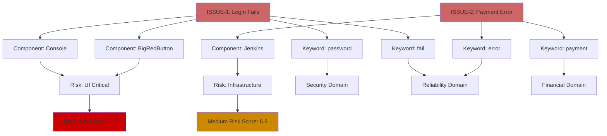
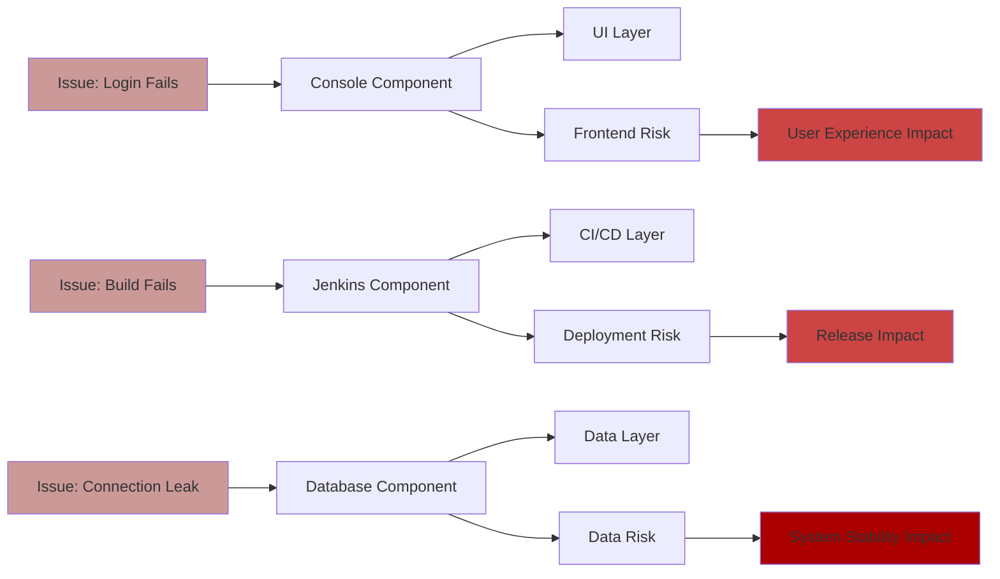
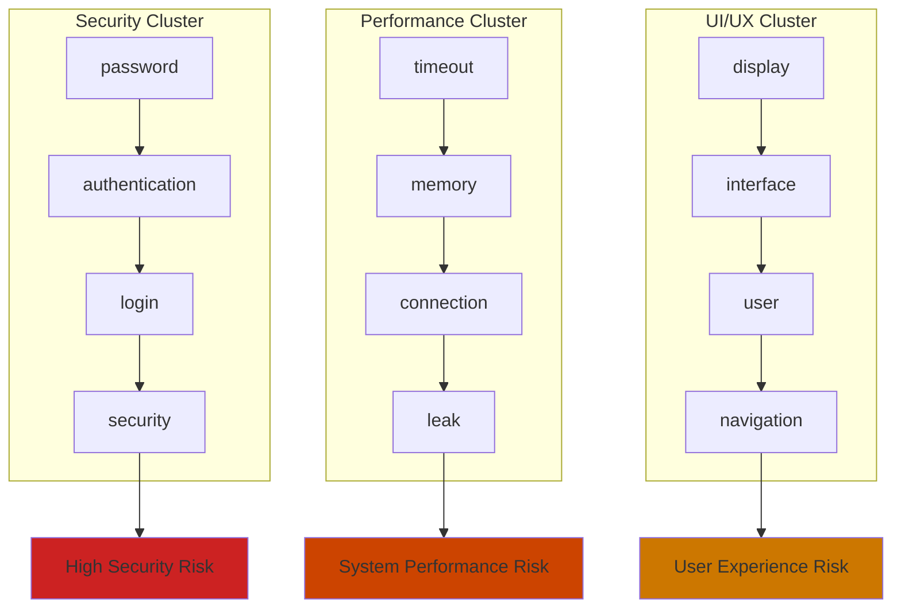

# Knowledge Graphs for Risk Analysis

## What are Knowledge Graphs?

Knowledge graphs are structured representations of information that model relationships between entities in a network format. They consist of:

- **Nodes (Entities)**: Things like issues, components, keywords, users
- **Edges (Relations)**: Connections like "causes", "affects", "contains", "similar to"
- **Properties**: Attributes like severity, frequency, confidence scores

## Knowledge Graph Patterns

### 1. Entity-Relationship Pattern

```
[Issue] --affects--> [Component] --deployed_in--> [Environment]
   |                     |
contains              maintained_by
   |                     |
   v                     v
[Keyword] <--shared--> [Team]
```

### 2. Hierarchical Pattern

```
[Domain: Security]
    |-- [Issue: Login Failed]
    |   |-- [Keyword: authentication]
    |   |-- [Keyword: password]
    |   `-- [Component: Auth Service]
    |
    `-- [Issue: Data Breach]
        |-- [Keyword: encryption]
        `-- [Component: Database]
```

### 3. Temporal Pattern

```
[Issue A] --precedes--> [Issue B] --causes--> [Issue C]
    |                       |                    |
 [Time: T1]             [Time: T2]          [Time: T3]
```

## Risk Analysis Use Cases

### 1. Issue Risk Assessment Graph



### 2. Component Risk Propagation



### 3. Keyword-Based Risk Clustering



## Implementation for Your Risk Analyzer

### 1. Graph Schema Design

```go
type KnowledgeGraph struct {
    Issues     map[string]*Issue
    Components map[string]*Component
    Keywords   map[string]*Keyword
    Domains    map[string]*Domain
    Relations  []*Relation
}

type Relation struct {
    From     string    // Entity ID
    To       string    // Entity ID
    Type     string    // "affects", "contains", "causes"
    Weight   float64   // Relationship strength
    Metadata map[string]interface{}
}

type RiskScore struct {
    ComponentRisk map[string]float64
    DomainRisk    map[string]float64
    OverallRisk   float64
}
```

### 2. Risk Calculation Algorithms

#### Component Risk Scoring

```
Component Risk = (
    Σ(Issue Severity × Issue Frequency) +
    Σ(Keyword Confidence × Domain Weight) +
    Network Centrality Score
) / Normalization Factor
```

#### Domain Risk Assessment

```
Domain Risk = (
    Average Component Risk in Domain +
    Cross-Domain Impact Score +
    Historical Issue Pattern Weight
) × Time Decay Factor
```

### 3. Graph Queries for Risk Analysis

```sql
-- Find high-risk components
MATCH (i:Issue)-[:AFFECTS]->(c:Component)
WHERE i.severity > 8
RETURN c.name, COUNT(i) as issue_count, AVG(i.severity) as avg_severity
ORDER BY issue_count DESC, avg_severity DESC

-- Identify risk propagation paths
MATCH path = (c1:Component)-[:DEPENDS_ON*1..3]->(c2:Component)
WHERE EXISTS((i:Issue)-[:AFFECTS]->(c1))
RETURN path, length(path) as propagation_depth

-- Find keyword clusters indicating systemic issues
MATCH (k1:Keyword)<-[:CONTAINS]-(i:Issue)-[:CONTAINS]->(k2:Keyword)
WHERE k1.confidence > 0.8 AND k2.confidence > 0.8
RETURN k1.word, k2.word, COUNT(i) as co_occurrence
ORDER BY co_occurrence DESC
```

### 4. Risk Visualization Examples

#### Network Risk Map

```
High Risk Components: [Database, Auth Service]
├── Connected Issues: 15
├── Propagation Paths: 8
└── Risk Score: 9.2/10

Medium Risk Components: [UI Layer, Cache]
├── Connected Issues: 8
├── Propagation Paths: 4
└── Risk Score: 6.5/10
```

#### Temporal Risk Evolution

```
Timeline Risk Analysis:
Week 1: Security Domain Risk ↑ (Login issues surge)
Week 2: Performance Domain Risk ↑ (Memory leaks detected)
Week 3: Cross-domain Risk ↑ (Security + Performance)
Week 4: System-wide Risk Alert (Risk Score > 8.0)
```

## Benefits for Issue Management

### 1. **Predictive Risk Assessment**

- Identify components likely to fail based on keyword patterns
- Predict cascading failures through dependency analysis
- Early warning for systemic issues

### 2. **Root Cause Analysis**

- Trace issue origins through relationship paths
- Identify common factors across multiple issues
- Find hidden dependencies causing problems

### 3. **Resource Allocation**

- Prioritize fixes based on network impact analysis
- Allocate teams to highest-risk components
- Optimize testing coverage using risk scores

### 4. **Pattern Recognition**

- Detect recurring issue patterns across domains
- Identify seasonal or deployment-related risks
- Find correlation between keywords and outcomes

## Implementation Roadmap

### Phase 1: Basic Graph Construction

- [x] Extract entities (Issues, Components, Keywords)
- [x] Define relationships (affects, contains, similar_to)
- [ ] Build graph database schema

### Phase 2: Risk Scoring Engine

- [ ] Implement centrality algorithms
- [ ] Develop risk propagation models
- [ ] Create domain-specific risk weights

### Phase 3: Advanced Analytics

- [ ] Temporal risk analysis
- [ ] Predictive modeling
- [ ] Interactive risk visualization

### Phase 4: Integration & Automation

- [ ] Real-time risk monitoring
- [ ] Automated alert system
- [ ] Integration with existing tools

## Tools & Technologies

### Graph Databases

- **Neo4j**: Industry standard with Cypher query language
- **Amazon Neptune**: Cloud-native graph database
- **ArangoDB**: Multi-model database with graph capabilities

### Graph Libraries

- **Go**: `github.com/dominikbraun/graph`
- **Python**: `networkx`, `pyvis`, `neo4j-driver`
- **Visualization**: D3.js, Cytoscape.js, Gephi

### Example Integration

```go
// Initialize knowledge graph
kg := NewKnowledgeGraph()

// Add entities from your current system
for _, issue := range issues {
    kg.AddIssue(issue)

    // Extract relationships
    for _, keyword := range issue.Keywords {
        kg.AddRelation(issue.ID, keyword.Word, "contains", keyword.Confidence)
    }

    for _, component := range issue.Components {
        kg.AddRelation(issue.ID, component, "affects", 1.0)
    }
}

// Calculate risk scores
riskScores := kg.CalculateRiskScores()
highRiskComponents := kg.FindHighRiskComponents(threshold: 8.0)
```

This knowledge graph approach would transform your current keyword extraction into a comprehensive risk intelligence system, providing deeper insights into issue patterns and system vulnerabilities.
